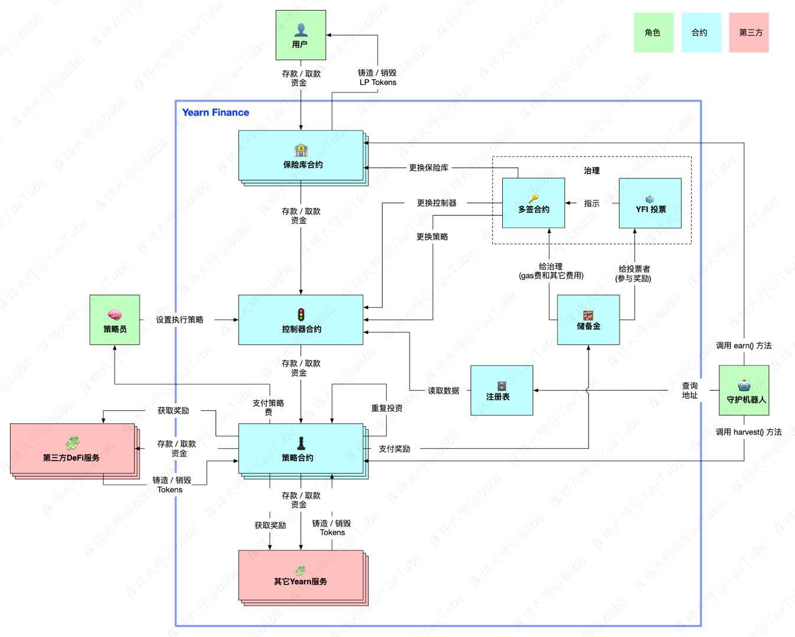

# yEarn Finance项目中文注释，中文文档

- via 崔棉大师 持续更新中

## yEarn合约结构

## 控制器合约

- [合约文档](./docs/Controller.md)

## ETH/WETH

- 保险库文档: [WrappedEther(yWETH)](./docs/WrappedEther(yWETH).md)
- 目前策略文档: [StrategyMKRVaultDAIDelegate](./docs/StrategyMKRVaultDAIDelegate.md)

## USDC

- 保险库文档: [yUSDCVault](./docs/yUSDCVault.md)
- 目前策略文档: [StrategyDForceUSDC](./docs/StrategyDForceUSDC.md)

