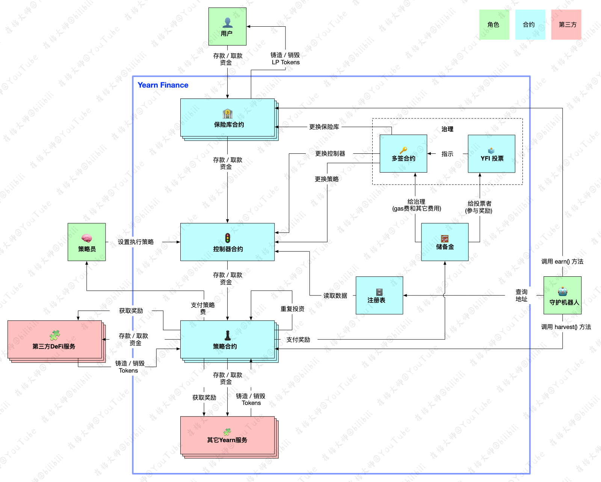

# yEarn Finance项目中文注释，中文文档

- via 崔棉大师 持续更新中

## yEarn合约结构

## VAULT模块

### 控制器合约

- [合约文档](./docs/Controller.md)

### ETH/WETH

- 保险库文档: [yWETHVault](./docs/yWETHVault.md)
- 目前策略文档: [StrategyMKRVaultDAIDelegate](./docs/StrategyMKRVaultDAIDelegate.md)

### DAI

- 保险库文档: [yWETHVault](./docs/yDAIVault.md)
- 目前策略文档: [StrategyDAICurve](./docs/StrategyDAICurve.md)

### curve.fi/y LP

- 保险库文档: [yWETHVault](./docs/yLPVault.md)
- 目前策略文档: [StrategyCurveYVoterProxy](./docs/StrategyCurveYVoterProxy.md)

### USDC

- 保险库文档: [yUSDCVault](./docs/yUSDCVault.md)
- 目前策略文档: [StrategyDForceUSDC](./docs/StrategyDForceUSDC.md)

## EARN模块

### DAI(yDAI)

- [合约文档](./docs/iearnDAI(yDAI).md)