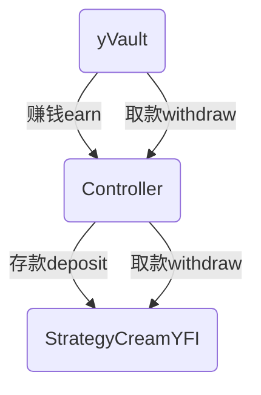

# yEarn Contracts

# USDC保险库合约

## 保险库合约
- 赚钱方法earn:
    - 将空闲余额发送到控制器
    - 调用控制器的`赚钱earn`方法,参数为USDC合约地址和空闲的余额
- 存款方法deposit:
    - 份额 = 存款数额 * 总量 / 当前合约在USDC的余额
    - 为调用者铸造份额(当前合约也是erc20合约,在当前合约中铸造数额为`份额`的erc20 Token)
- 提款方法withdraw:
    - 根据份额计算出用户的取款数额
    - 将份额销毁
    - 如果当前合约的余额不足,需要调用控制器合约的`取款withdraw`方法将USDC取回到当前合约
    - 将份额对应的取款数额发给用户
- 赚钱和提款方法都会调用控制器合约

## 控制器合约
- 赚钱方法earn:
    - 调用策略地址的want地址
    - 如果want地址对应地址不等于USDC地址
        - 将空闲的余额数量的USDC发送到转换器
        - 将换后的want发送到策略地址
    - 否则将空闲的余额数量发送到策略合约
    - 最后执行策略合约的`存款deposit`方法
- 提款方法withdraw:
    - 只能由token的保险库合约执行
    - 执行策略合约的`提款withdraw`方法,参数为提款数量

## 策略合约
- 存款方法deposit:
    - 将合约中的USDC发送给dForce: dUSDC Token铸造DToken
    - 再将DToken发送到dForce: Unipool做质押
- 提款方法withdraw:
    - 执行dForce: Unipool的退出方法
    - 提款dUSDC Token到当前账户,并获取奖励(DF Token)
    - 然后执行dUSDC的赎回方法到当前合约,换回USDC
    - 扣除提款费5%,发送USDC给控制器合约的奖励地址
    - 将剩余的USDC发送到`保险库`
- 收获方法harvest:
    - 获取dForce: Unipool的奖励(DF Token)
    - 调用uniswap用精确的token交换尽量多的token方法,用dForce: DF Token换取USDC,发送到当前合约
    - 扣除手续费50%,发送USDC给控制器合约的奖励地址
    - 将剩余的USDC重新进入`存款方法`